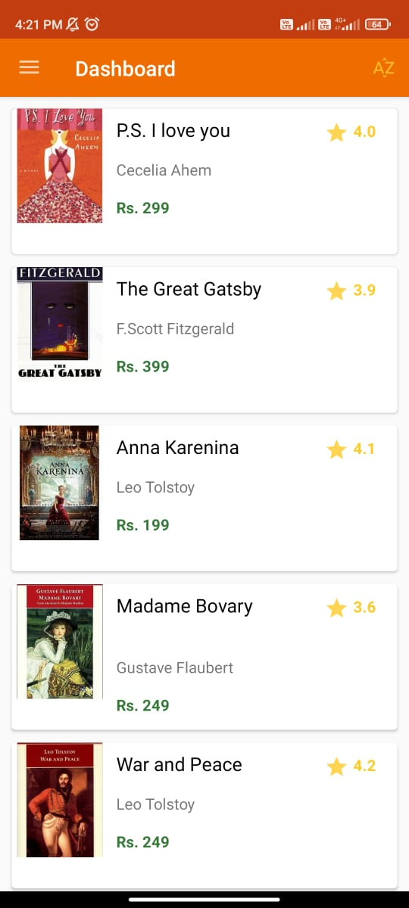

# BookHub-App
A Simple android app for displaying top 10 must read books. 
Following concepts are impleted in this app -:
* Activity and Fragments.
* Navigatoin Drawer for letting user to navigate across different fragments.
* Recycler view to display the list of books
* Storing and fetching data from SQLite database.

# Screenshots

